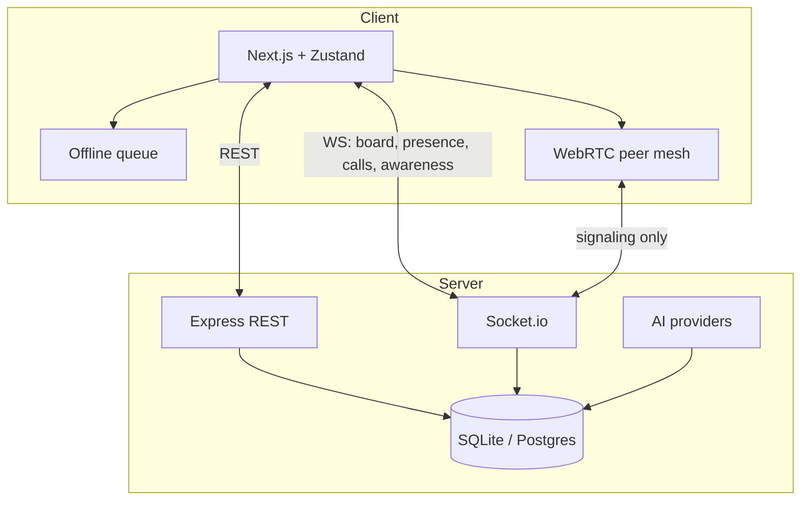

# Architecture

## System overview

SyncBoard AI+ is a monorepo with two apps:

| App | Path | Role |
| --- | --- | --- |
| **Web** | `apps/web` | Next.js 15 UI — boards, dashboard, SyncRoom client |
| **Server** | `apps/server` | Express REST API + Socket.io realtime + Prisma |

Media (audio/video) flows **peer-to-peer**. The server never stores or relays video streams.

## Realtime channels

| Socket event / room | Purpose |
| --- | --- |
| `project:{id}` | Board updates, presence on that board |
| `call:{id}` | WebRTC signaling, SyncRoom session events, notes, whiteboard |
| `user:{id}` | Cross-project teammate awareness |

## Data model (high level)

- **User** — authentication, profile.
- **Project** → **Column** → **Task** — kanban hierarchy.
- **Membership** — user ↔ project access control.
- **Activity** — audit log per project (task moves, etc.).
- **SyncRoomSession** + **SyncRoomEvent** — persisted call timeline.
- **SyncRoomArtifact** — links attached during a session (optional).

## AI layer

Pluggable via `AI_PROVIDER`:

- **`heuristic` (default)** — rule-based board analysis (stagnation, deadlines, WIP, workload). Deterministic, testable, no API key.
- **`openai`** — LLM for meeting summaries and richer text when configured.

Insights surface in **AI Insights** with **one-click actions** (reassign, move column, extend due date, start SyncRoom).

## Offline resilience

1. Optimistic update in Zustand.
2. REST call; on success, server broadcasts `board:updated`.
3. On network failure → queue in `localStorage`, show offline badge.
4. On reconnect → replay queue in order.

## Security

- JWT on REST and Socket.io handshake.
- `assertMember` on every project-scoped route.
- WebRTC signals only relayed between sockets in the **same** call room.
- Rate limiting on auth endpoints (production).

## Scaling notes

- Single-instance: in-memory presence, calls, awareness (current dev default).
- Multi-instance: Redis adapter for Socket.io + shared presence (documented in `docker-compose.yml`).
- Postgres recommended for production (`prisma` provider switch).
